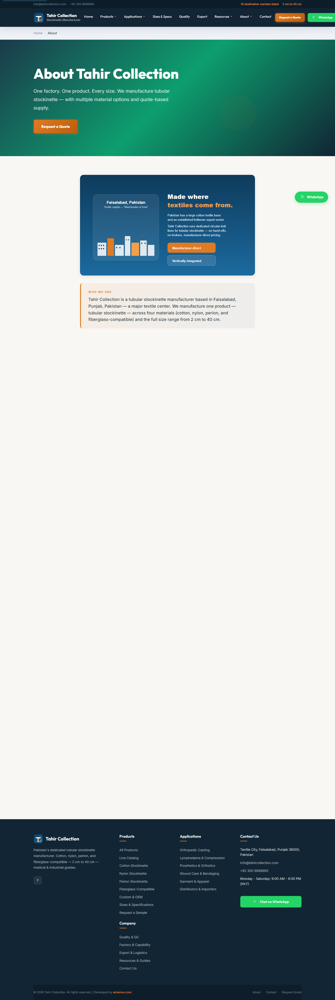
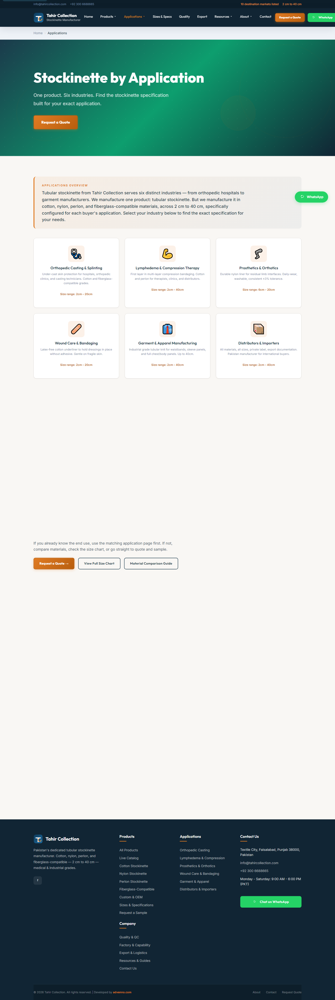

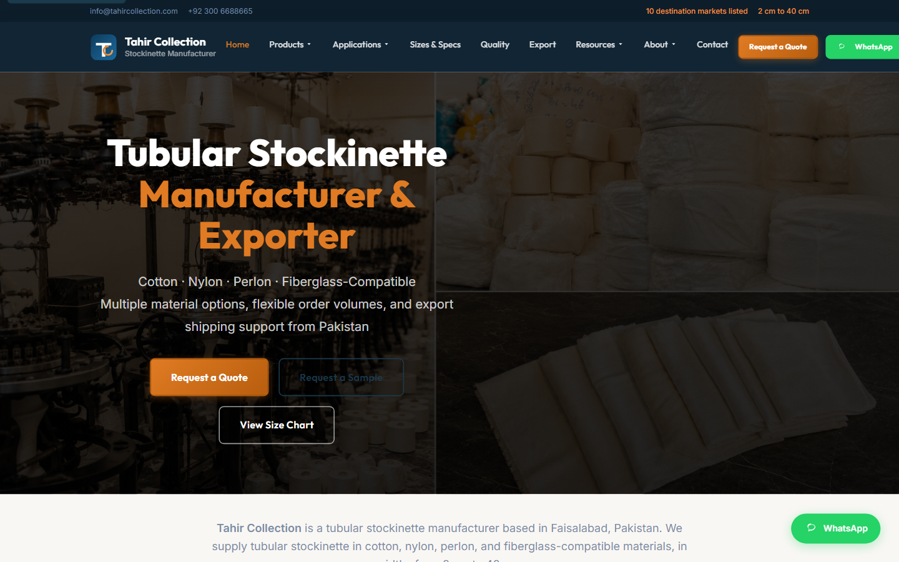
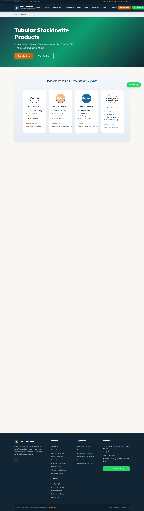

# Tahir Collection - Stockinette Manufacturer Web Platform

> SEO-led site for a tubular stockinette manufacturer, organised by material and industrial application.

Built by **[Muhammad Tanveer](https://www.linkedin.com/in/muhammad-tanveer-advenno/)** - Full-Stack AI Automation Engineer.

 

## Contents

- [The problem](#the-problem)
- [The approach](#the-approach)
- [Architecture](#architecture)
- [Tech stack](#tech-stack)
- [Key capabilities](#key-capabilities)
- [Screenshots](#screenshots)
- [Results](#results)
- [FAQ](#faq)
- [Source code and access](#source-code-and-access)
- [About the engineer](#about-the-engineer)
- [Related projects](#related-projects)

## The problem

A specialist textile manufacturer was invisible to the buyers searching for it. Buyers search by application - orthopaedic casting, lymphedema compression, meat processing, industrial polishing - but the site was organised around the company instead of those uses.

## The approach

Restructure the site around how buyers actually search: a page per material and a page per industrial application, each targeting the specific term that application's buyers use. Product imagery is named and described for the same terms rather than left as raw camera filenames.

## Architecture

| Component | Responsibility |
| --- | --- |
| **Application pages** | One page per industrial use case |
| **Product pages** | One page per material and construction |
| **Shared includes** | Common layout, navigation and contact components |
| **Media** | Descriptively named, application-specific imagery |

## Tech stack

| Layer | Technology |
| --- | --- |
| Backend | PHP |
| Frontend | Server-rendered, no build step |
| SEO | Application-targeted information architecture |
| Media | Optimised WebP imagery |

## Key capabilities

- Application-led information architecture
- Material-specific product pages
- Structured quote requests
- Descriptive, search-visible media naming
- Multi-language entry points

## Screenshots

## Results

- Site organised around buyer search intent rather than company structure
- Each industrial application has a dedicated, targetable page

## FAQ

### What is tubular stockinette?

A seamless knitted tube used under orthopaedic casts, in compression therapy, meat processing and industrial polishing.

### Why a page per application?

Buyers search by their use case, not by the manufacturer. Separate pages let each application rank for its own terms.

### Who maintains it?

Content is server-rendered PHP with shared includes, so pages can be added without a build step.

### Is the source available?

Client project - private repository.

## Source code and access

This repository is the public case study for **Tahir Collection - Stockinette Manufacturer Web Platform**. The full implementation - application code, database schema, tests and deployment configuration - lives in a **private repository** on this account, alongside the rest of the work shown here.

Source access can be arranged for hiring conversations, technical review or client due diligence. The quickest route is a short message on [LinkedIn](https://www.linkedin.com/in/muhammad-tanveer-advenno/) or an email to [mtanveertahir6666@gmail.com](mailto:mtanveertahir6666@gmail.com).

## About the engineer

**Muhammad Tanveer - Full-Stack AI Automation Engineer**

Full-stack AI automation engineer. I build agentic systems, browser and workflow automation, RAG pipelines and the production web platforms they run on - from Rust and Python services to Next.js dashboards and PHP/MySQL business systems.

- GitHub: [haddindeve](https://github.com/haddindeve)
- LinkedIn: [Muhammad Tanveer](https://www.linkedin.com/in/muhammad-tanveer-advenno/)
- Email: [mtanveertahir6666@gmail.com](mailto:mtanveertahir6666@gmail.com)
- Location: Pakistan

## Related projects

- [AuthentID - eMRTD Chip Identity Verification](https://github.com/haddindeve/authentid-emrtd-face-verification)
- [Business OS - AI-Native Multi-Branch ERP](https://github.com/haddindeve/business-os-multi-branch-erp)
- [CRAlign - AI Musculoskeletal Wellness Assessment](https://github.com/haddindeve/cralign-msk-wellness-ai)
- [Crypto Trading Bot with Control Dashboard](https://github.com/haddindeve/crypto-trading-bot-dashboard)
- [SJ-AIOS - AI Operating System for Retail Operations](https://github.com/haddindeve/sj-aios-ai-operating-system)
- [ACIP - AI Content Intelligence Platform](https://github.com/haddindeve/bloggen-ai-content-platform)

---

Tahir Collection - Stockinette Manufacturer Web Platform - case study by Muhammad Tanveer - Full-Stack AI Automation Engineer. Keywords: tubular stockinette manufacturer, stockinette supplier, orthopaedic casting stockinette, industrial textile manufacturer, B2B textile export, application-based product pages.